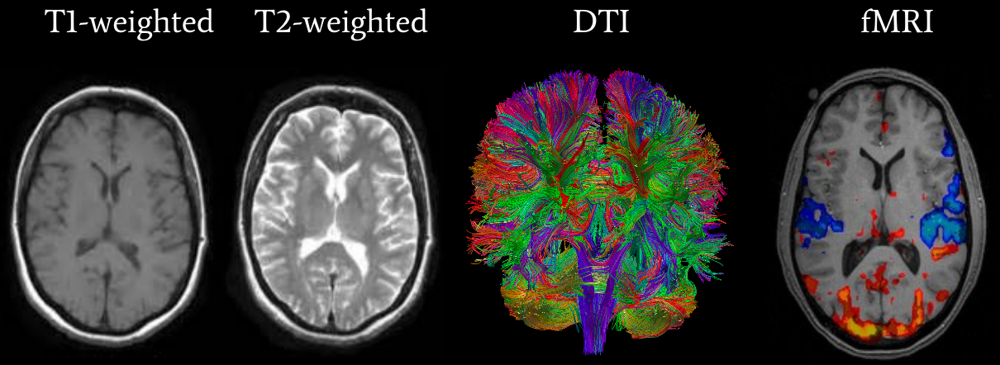



## Types of MR Scans

Anatomical
3-dimensional image of anatomy
3D "pixel" is a "voxel"
T1w is the most common
White matter is white, Gray matter is gray, cerebral spinal fluid is black

Functional MRI
track the blood oxygen level dependant (BOLD) signal
4-dimensional (x, y, z + time)

Diffusion MRI
measures diffusion of water in order to model tissue microstructure
4-dimensional (x, y, z + direction of diffusion)
need parameters about the strength of the diffusion "gradient" and its direction (.bval and .bvec)

## Neuroimaging File Formats

|Format Name | File Extension | Origin |
|---|---|---|
| Analyze | .img/.hdr | Analyze Software, Mayo Clinic |
| DICOM | none | ACR/NEMA Consortium |
| NIfTI | .nii | Neuroimaging Informatics Technology Initiative |
| MINC | .mnc | Montreal Neurological Institute |
| NRRD | .nrrd | |

From the MRI scanner, images are initially collected in the DICOM format and can be converted to NIfTI using [dcm2niix](https://github.com/rordenlab/dcm2niix).

Do a conversion to nii.gz

NIfTI is one of the most ubiquitous file formats for storing neuroimaging data. We'll cover a few details to get started working with them. If you're interested in learning more about NIfTI images, we highly recommend [this blog post about the NIfTI format](http://brainder.org/2012/09/23/the-nifti-file-format/).

