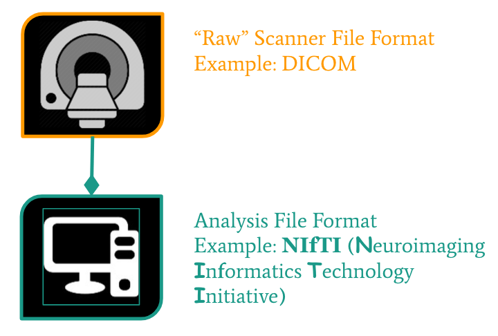

---
jupyter:
  jupytext:
    formats: ipynb,md
    text_representation:
      extension: .md
      format_name: markdown
      format_version: '1.3'
      jupytext_version: 1.13.8
  kernelspec:
    display_name: Python 3
    language: python
    name: python3
---

# From the scanner to our computer

SMALL INTRO BLURB ABOUT DIFFERENT MR SCANS

## Neuroimaging file formats

|Format Name | File Extension | Origin |
|---|---|---|
| DICOM | none | ACR/NEMA Consortium |
| Analyze | .img/.hdr | Analyze Software, Mayo Clinic |
| NIfTI | .nii | Neuroimaging Informatics Technology Initiative |
| MINC | .mnc | Montreal Neurological Institute |
| NRRD | .nrrd | |

From the MRI scanner, images are initially collected in the DICOM format and can be converted to these other formats to make working with the data easier.



Let's download some example DICOM data to see what it looks like.
This data was generously shared publicly by the [Princeton Handbook for Reproducible Neuroimaging](https://brainhack-princeton.github.io/handbook/).

```bash

wget https://zenodo.org/record/3677090/files/0219191_mystudy-0219-1114.tar.gz -O data/0219191_mystudy-0219-1114.tar.gz
mkdir -p ../data/dicom_examples
tar -xvzf ../data/0219191_mystudy-0219-1114.tar.gz -C ../data/dicom_examples
gzip -d ../data/dicom_examples/0219191_mystudy-0219-1114/dcm/*dcm.gz
rm ../data/0219191_mystudy-0219-1114.tar.gz
```

NIfTI is one of the most ubiquitous file formats for storing neuroimaging data.
If you're interested in learning more about NIfTI images, we highly recommend [this blog post about the NIfTI format](http://brainder.org/2012/09/23/the-nifti-file-format/).
We can convert our DICOM data to NIfTI using [dcm2niix](https://github.com/rordenlab/dcm2niix).

We can learn how to run `dcm2niix` by taking a look at its help menu.

```bash

dcm2niix -help
```

### Converting DICOM to NIfTI

<!-- #region solution2="hidden" solution2_first=true -->
**EXERCISE:** Convert the Princeton DICOM data to NIfTI
<!-- #endregion -->

```python

```

```bash solution2="hidden"

mkdir -p ../data/dicom_examples/nii
dcm2niix \
    -z y \
    -o ../data/dicom_examples/nii \
    ../data/dicom_examples/0219191_mystudy-0219-1114/dcm
```
