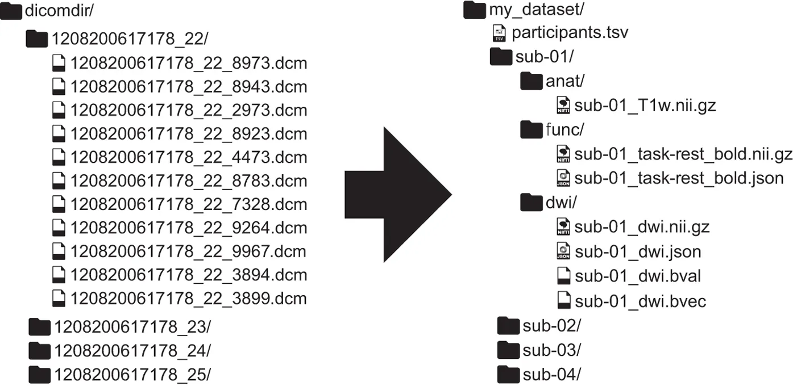

---
jupyter:
  jupytext:
    formats: ipynb,md
    text_representation:
      extension: .md
      format_name: markdown
      format_version: '1.3'
      jupytext_version: 1.13.8
  kernelspec:
    display_name: Python 3
    language: python
    name: python3
---

# Data organization with BIDS

---

## When NIfTI isn't enough

So far, we've only worked with a single T1w scan from a single subject. However, neuroimaging research requires working with **different scan modalities** across **several subjects** (sometimes even **multiple timepoints**)!

<!-- #region solution2="hidden" solution2_first=true -->
**EXERCISE:** Let's take a look at the rest of our NIfTI dataset from the last lesson. Imagine you are a collaborator who's currently gotten your hands on this dataset for an analysis. What are some immediate questions you might have that aren't apparent at a first glance?

```
nii
├── dcm_anat_ses-01_T1w_20190219111436_5.json
├── dcm_anat_ses-01_T1w_20190219111436_5.nii.gz
├── dcm_func_ses-01_task-faces_run-01_20190219111436_13.json
├── dcm_func_ses-01_task-faces_run-01_20190219111436_13.nii.gz
├── dcm_func_ses-01_task-sound_run-01_20190219111436_6.json
├── dcm_func_ses-01_task-sound_run-01_20190219111436_6.nii.gz
├── dcm_func_ses-01_task-sound_run-01_20190219111436_7.json
├── dcm_func_ses-01_task-sound_run-01_20190219111436_7.nii.gz
├── dcm_func_ses-01_task-sound_run-01_20190219111436_8.json
├── dcm_func_ses-01_task-sound_run-01_20190219111436_8.nii.gz
├── dcm_func_ses-01_task-story_run-01_20190219111436_9.json
├── dcm_func_ses-01_task-story_run-01_20190219111436_9.nii.gz
├── dcm_func_ses-01_task-story_run-02_20190219111436_10.json
├── dcm_func_ses-01_task-story_run-02_20190219111436_10.nii.gz
├── dcm_func_ses-01_task-story_run-03_20190219111436_11.json
├── dcm_func_ses-01_task-story_run-03_20190219111436_11.nii.gz
├── dcm_func_ses-01_task-story_run-04_20190219111436_12.json
└── dcm_func_ses-01_task-story_run-04_20190219111436_12.nii.gz
```
<!-- #endregion -->

<!-- #region solution2="hidden" -->
- How many subjects were scanned?
- What are the demographics of the participants?
- What is the name of the dataset?
- Who are the authors of the dataset?
- Is there a citation I should use to give credit to the authors?
- Is there a more elaborate description of the fMRI tasks?
- Do any of the fMRI tasks have an event-related design?
- What do the fMRI task stimuli look like?
<!-- #endregion -->

## Introducing BIDS

The [Brain Imaging Data Structure (BIDS)](https://www.nature.com/articles/sdata201644) is a simple and intuitive way to organize and describe your neuroimaging and behavioural data. Neuroimaging experiments result in complicated data that can be arranged in several different ways. BIDS tackles this problem by suggesting a new standard (based on consensus from multiple researchers across the world) for the arrangement of neuroimaging datasets. Using the same organizational standard for all of your studies will also allow you to easily reuse your scripts and share data and code with other researchers.

For this lesson, we'll be focusing on organizing MRI data. However, BIDS has since expanded with specifications for [MEG](https://www.nature.com/articles/sdata2018110), [EEG](https://www.nature.com/articles/s41597-019-0104-8), [iEEG](https://www.nature.com/articles/s41597-019-0105-7), [PET](https://journals.sagepub.com/doi/10.1177/0271678X20905433), and [genetics](https://academic.oup.com/gigascience/article/9/10/giaa104/5928221).

For a more comprehensive overview, check out the [BIDS Starter Kit](https://github.com/bids-standard/bids-starter-kit/wiki).





## Structure

The current BIDS specification is [documented online](https://bids-specification.readthedocs.io/en/stable/).


```
dataset/
  rawdata/
    dataset_description.json
    participants.tsv
    CHANGES
    README
    task-rest.json
    sub-01/
      ses-01/
        anat/
        func/
    sub-02/
    ...
  sourcedata/
    ...
  derivatives/
    pipeline_1/
    pipeline_2/
    ...
  code/
  stimuli/
```


**EXERCISE**: The Case of Rea Seach

> Hey Rea,  
> Great to see you at the conference last month. Here's the data we talked about for that
new project. We tested 1 male participant with structural and a few of our favorite tasks.  
> The data is organized according to modality.
> Looking forward to seeing how this project works out!  
> Cole Labo

Lets try converting the NIfTI data to BIDS manually.

```bash

mkdir -p ../data/dicom_examples/bids/sub-01/{anat,func}
```

```python
import json
from collections import OrderedDict

data= OrderedDict()
data['Name'] = 'BIDS Test'
data['BIDSVersion'] = '1.6.0'
data['License'] = ''
data['Authors'] = ['']
data['Acknowledgements'] = ''
data['HowToAcknowledge'] = ''
data['Funding'] = ['','','']
data['ReferencesAndLinks'] = ['','','']
data['DatasetDOI'] = ''
dataset_json_name='../data/dicom_examples/bids/dataset_description.json'

with open(dataset_json_name, 'w') as f:
    json.dump(data, f, sort_keys=False, indent=2)
```

## Conversion methods

- [Dcm2Bids](https://github.com/cbedetti/Dcm2Bids)
- [heudiconv](https://github.com/nipy/heudiconv)
- [bidskit](https://github.com/jmtyszka/bidskit)
- [dac2bids](https://github.com/dangom/dac2bids)
- [BIDScoin](https://github.com/Donders-Institute/bidscoin)
- and more!

```bash

dcm2bids_scaffold -o ../data/dicom_examples/dcm2bids/
```

```bash

dcm2bids_helper \
  -d ../data/dicom_examples/0219191_mystudy-0219-1114/dcm \
  -o ../data/dicom_examples/dcm2bids
```

<!-- #region solution2="hidden" solution2_first=true -->
`Dcm2Bids` uses a configuration file in order to match scans with the appropriate BIDS filename. We will create this file together but it can also be revealed by clicking the toggle below.
<!-- #endregion -->

<!-- #region solution2="hidden" -->
{
    "descriptions": [
        {
        "dataType": "anat",
        "modalityLabel": "T1w",
        "criteria": { "SeriesDescription": "anat_ses-01_T1w" }
        },
        {
        "dataType": "func",
        "modalityLabel": "bold",
        "customLabels": "task-sound",
        "criteria": { "SeriesDescription": "func_ses-01_task-sound*" }
        },
        {
        "dataType": "func",
        "modalityLabel": "bold",
        "customLabels": "task-story",
        "criteria": { "SeriesDescription": "func_ses-01_task-story*" }
        },
        {
        "dataType": "func",
        "modalityLabel": "bold",
        "customLabels": "task-faces",
        "criteria": { "SeriesDescription": "func_ses-01_task-faces*" }
        }
    ]
}
<!-- #endregion -->

```bash

mkdir -p ../data/dicom_examples/dcm2bids/rawdata
dcm2bids \
  -d ../data/dicom_examples/0219191_mystudy-0219-1114/dcm \
  -p 01 -s 01 \
  -c ../data/dicom_examples/dcm2bids/code/bids_config.json \
  -o ../data/dicom_examples/dcm2bids/rawdata
```

## BIDS validator

Can be run [online](https://bids-standard.github.io/bids-validator)

> Selecting a dataset only performs validation. Files are never uploaded.

Select the data directory and wait for it to finish validation.

View errors and warnings.


---

#### References
1. Gorgolewski, K. J., Auer, T., Calhoun, V. D., Craddock, R. C., Das, S., Duff, E. P., … Poldrack, R. A. (2016). The brain imaging data structure, a format for organizing and describing outputs of neuroimaging experiments. Scientific Data, 3(1). https://doi.org/10.1038/sdata.2016.44
