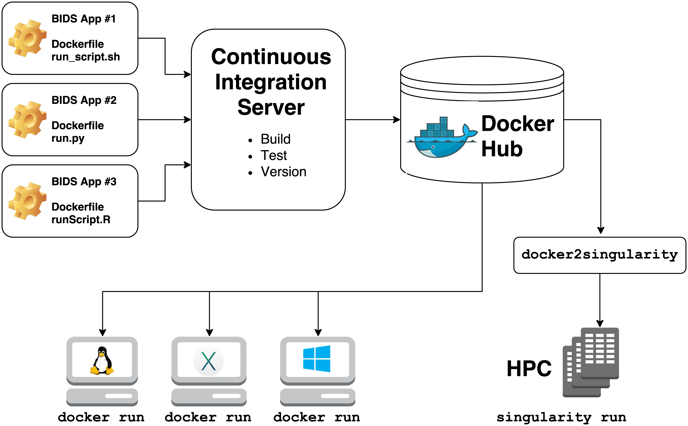



[BIDS Apps](https://bids-apps.neuroimaging.io/) are containerized applications that run on BIDS data structures.  

Some examples include:
- mriqc
- fmriprep
- freesurfer
- ciftify
- SPM
- MRtrix3_connectome

They rely on 2 technologies for container computing:
- **Docker**
  - for building, hosting, and running containers on local hardware (Windows, Mac OS, Linux) or in the cloud
- **Singularity**
  - for running containers on high performance compute clusters

Building a singularity container is as easy as:

~~~
singularity build mriqc-0.16.1.simg docker://poldracklab/mriqc:0.16.1`
~~~
{: .language-bash}

To run the container:

~~~
singularity run --cleanenv \
  -B bids_folder:/data \
  mriqc-0.16.1.simg \
  /data /data/derivatives participant
~~~
{: .language-bash}
