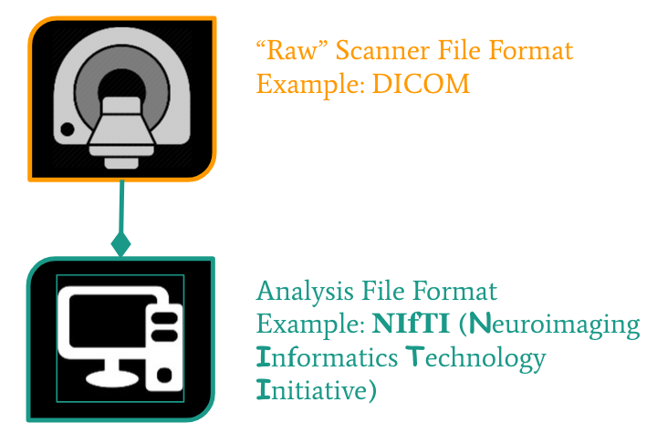

## Why Python?

- free, open source
- one platform for data pre-processing, visualization and analysis
- reproducible code
- large number of user-developed packages (eg. nibabel, nilearn)
- easy interaction with state-of-the art neuroimaging software (eg. FSL, ANTS)

## Types of MR Scans

{:class="img-responsive"}

anat

func

dwi

## Neuroimaging File Formats

|Format Name | File Extension | Origin |
|---|---|---|
| Analyze | .img/.hdr | Analyze Software, Mayo Clinic |
| DICOM | none | ACR/NEMA Consortium |
| NIfTI | .nii or .img/.hdr | Neuroimaging Informatics Technology Initiative |
| MINC | .mnc | Montreal Neurological Institute |
| NRRD | .nrrd | |

{:class="img-responsive"}

From the MRI scanner, images are initially collected in the DICOM format and can be converted to NIfTI using [dcm2niix](https://github.com/rordenlab/dcm2niix).

## Intro to NIfTI

NIfTI is one of the most ubiquitous file formats for storing neuroimaging data. We'll cover a few details to get started working with them. If you're interested in learning more about NIfTI images, we highly recommend [this blog post about the NIfTI format](http://brainder.org/2012/09/23/the-nifti-file-format/).
