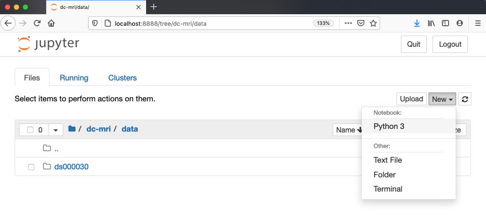
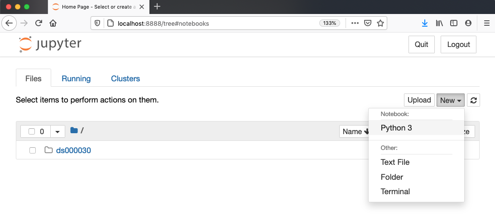

## Overview

This lesson is designed to be run on either a personal computer or in a web-based interactive computational environment using [Binder][binder-info].

## Binder

The Binder webpage for this lesson can be accessed at [the following link][binder-repo].
Binder enables you to run the collection of Python notebooks found in the `code` folder.
All of the software and data used in the lesson are pre-installed in a custom computational environment and no additional software needs to be installed locally.

> ## Binder Tips
> If using Binder, please be aware that startup can take anywhere from 30 seconds to 10 minutes, depending on your internet connection and how recent the custom environment was used.
> Also, files can be uploaded to the Binder environment.
> However, the state of the environment is not permanent.
> If you are inactive for 10 minutes, the environment will shut down and all data will be lost.
> You should save any changed files to their computers in order to preserve them.
{: .callout}

## Local

### Install Python

In this lesson, we will be using Python 3 with some of its most popular scientific and neuroimaging libraries.
Although one can install a plain-vanilla Python and all required libraries by hand, we recommend installing [Anaconda][anaconda-website], a Python distribution that comes with everything we need for the lesson.
Detailed installation instructions for various operating systems can be found on The Carpentries [template website for workshops][anaconda-instructions] and in the [Anaconda documentation][anaconda-install].

### Install Python Packages

Pip is the most common package installer for Python. This lesson requires a few additional neuroimaging-specific Python packages that can be installed with:

~~~
pip install nibabel pybids
~~~
{: .language-bash}

### Install dcm2niix

We will be using the `dcm2niix` software package for converting neuroimaging data from the DICOM format that is exported from the MRI scanner to the NIfTI format, which is much easier to work with.
Detailed installation instructions for various operating systems can be found on the [dcm2niix README][dcm2niix-install].
If using the Anaconda Python distribution described earlier, `dcm2niix` can be installed by running:

~~~
conda install -c conda-forge dcm2niix
~~~
{: .language-bash}

### Install DataLad

In order to obtain some of the data that will be used in this lesson, we will be using DataLad, a tool for managing and version controlling large datasets.
Detailed installation instructions for various operating systems can be found in the [Datalad Handbook] [datalad-install].
Again, if using Anaconda, DataLad can be easily installed by running:

~~~
conda install -c conda-forge datalad
~~~
{: .language-bash}

### Obtain lesson materials

Once DataLad has been installed, create a new folder on your Desktop and download the [ds000030 dataset][ds000030] found on OpenNeuro.

~~~
mkdir ~/Desktop/dc-mri/data
cd ~/Desktop/dc-mri/data
datalad install ///openneuro/ds000030
~~~
{: .language-bash}

## Launch Python interface

To start working with Python, we need to launch a program that will interpret and execute our Python
commands. Below we list several options. If you don't have a preference, proceed with the top
option in the list that is available on your machine. Otherwise, you may use any interface you like.

### Option A: Jupyter Notebook

A Jupyter Notebook provides a browser-based interface for working with Python.
If you installed Anaconda, you can launch a notebook in two ways:

> ## Anaconda Navigator
>
> 1. Launch Anaconda Navigator.
> It might ask you if you'd like to send anonymized usage information to Anaconda developers:
> 
> Make your choice and click "Ok, and don't show again" button.
> 
> 2. Find the "Notebook" tab and click on the "Launch" button:
> 
> Anaconda will open a new browser window or tab with a Notebook Dashboard showing you the
> contents of your Home (or User) folder.
> 
> 3. Navigate to the `data` directory by clicking on the directory names leading to it:
> `Desktop`, `dc-mri`, then `data`:
> 
> 4. Launch the notebook by clicking on the "New" button and then selecting "Python 3":
> 
{: .solution}

> ## Command line (Terminal)
>
> 1\. Navigate to the `data` directory:
>
> > ## Unix shell
> > If you're using a Unix shell application, such as Terminal app in macOS, Console or Terminal
> > in Linux, or [Git Bash][gitbash] on Windows, execute the following command:
> > ~~~
> > cd ~/Desktop/dc-mri/data
> > ~~~
> > {: .language-bash}
> {: .solution}
>
> > ## Command Prompt (Windows)
> > On Windows, you can use its native Command Prompt program.  The easiest way to start it up is
> > pressing <kbd>Windows Logo Key</kbd>+<kbd>R</kbd>, entering `cmd`, and hitting
> > <kbd>Return</kbd>. In the Command Prompt, use the following command to navigate to
> > the `data` folder:
> > ~~~
> > cd /D %userprofile%\Desktop\dc-mri\data
> > ~~~
> > {: .language-bash}
> {: .solution}
>
> 2\. Start Jupyter server
>
> > ## Unix shell
> > ~~~
> > jupyter notebook
> > ~~~
> > {: .language-bash}
> {: .solution}
>
> > ## Command Prompt (Windows)
> > ~~~
> > python -m notebook
> > ~~~
> > {: .language-bash}
> {: .solution}
>
> 3\. Launch the notebook by clicking on the "New" button on the right and selecting "Python 3"
> from the drop-down menu:
> 
{: .solution}

&nbsp; <!-- vertical spacer -->

### Option B: IPython interpreter

IPython is an alternative solution situated somewhere in between the plain-vanilla Python
interpreter and Jupyter Notebook. It provides an interactive command-line based interpreter with
various convenience features and commands.  You should have IPython on your system if you installed
[Anaconda][anaconda-instructions].

To start using IPython, execute:
~~~
ipython
~~~
{: .language-bash}

&nbsp; <!-- vertical spacer -->

### Option C: plain-vanilla Python interpreter

To launch a plain-vanilla Python interpreter, execute:
~~~
python
~~~
{: .language-bash}

If you are using [Git Bash on Windows][gitbash], you have to call Python _via_ `winpty`:
~~~
winpty python
~~~
{: .language-bash}

[anaconda-install]: https://docs.anaconda.com/anaconda/install
[anaconda-instructions]: https://carpentries.github.io/workshop-template/#python
[anaconda-website]: https://www.anaconda.com/
[binder-info]: https://mybinder.readthedocs.io/en/latest/index.html
[binder-repo]: https://mybinder.org/v2/gh/carpentries-incubator/SDC-BIDS-IntroMRI.git/gh-pages
[datalad-install]: http://handbook.datalad.org/en/latest/intro/installation.html
[dcm2niix-install]: https://github.com/rordenlab/dcm2niix#install
[ds000030]: https://openneuro.org/datasets/ds000030/versions/1.0.0
[gitbash]: https://gitforwindows.org

